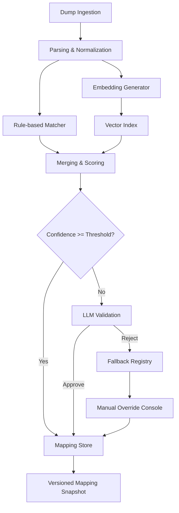
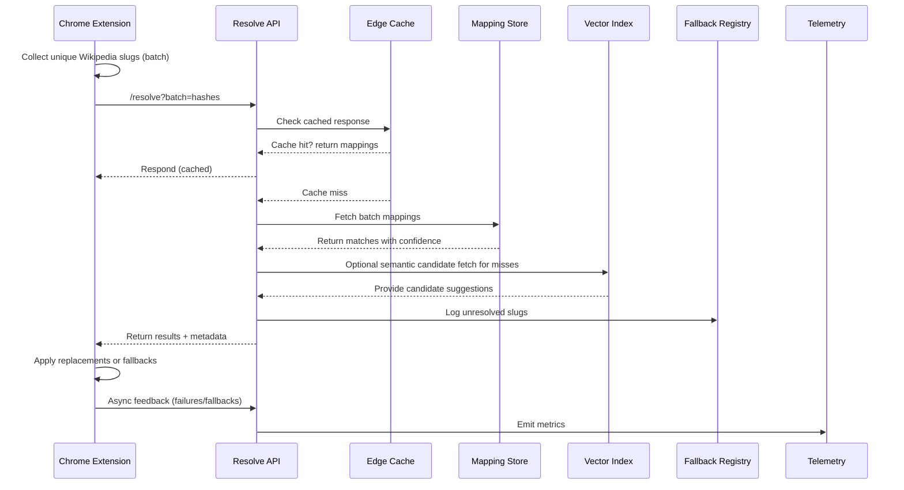

# Grokipedia Resolver Architecture

## System Overview
- Grokipedia Resolver rewrites Wikipedia links to Grokipedia equivalents by combining offline mapping, semantic search, and a low-latency resolve API consumed by the Chrome extension.
- Goals: maximize match accuracy, keep page latency low, guarantee safe fallbacks to Wikipedia, and preserve an auditable loop for manual curation.

## Components
- **Dump Ingestion Service**: Schedules and downloads Wikipedia and Grokipedia dumps, tracks version metadata, and queues parse jobs.
- **Parsing & Normalization Workers**: Extract canonical titles, redirects, disambiguation pages, and text snippets; emit normalized `wikipedia_slug` records.
- **Grokipedia Catalog Service**: Mirrors Grokipedia sitemap/API data, normalizes slugs, summaries, and categories for matching.
- **Rule-based Matcher**: Applies deterministic rules (slug normalization, redirect resolution, namespace filtering) to produce high-confidence direct mappings.
- **Embedding Generator**: Produces vector representations for Wikipedia snippets and Grokipedia pages; writes vectors to the index keyed by stable hash IDs.
- **Semantic Matcher**: Runs nearest-neighbor lookups against the vector index, merges candidates with rule outputs, and assigns confidence scores.
- **LLM Validation Service**: Reviews low-confidence candidate pairs using article summaries; records accept/reject decisions with audit logs.
- **Mapping Store**: Primary datastore (Postgres with hash indexes, KeyDB, or similar) storing `hash_id`, Grokipedia URL, confidence, source, TTL, and version metadata.
- **Fallback Registry**: Captures unmapped or rejected slugs to feed the manual review queue.
- **Manual Override Console**: Web UI for editors to approve overrides, inspect low-confidence matches, and publish incremental mapping bundles.
- **Resolve API**: Stateless HTTPS service (edge-capable) offering batch `/resolve` endpoints, caching, rate limiting, and signed responses.
- **Cache Layer**: CDN or edge cache with short TTL and ETag headers; the extension reuses results from `chrome.storage`.
- **Chrome Extension**: Content script and background worker that batches slug lookups, applies replacements, and annotates fallbacks on the page.
- **Telemetry & Monitoring**: Collects metrics, logs, and traces across pipeline and runtime paths; powers alerting and drift detection.
- **Security Wrapper**: Sanitizes inputs, enforces origin rules, anonymizes hashes, and redacts PII from external LLM calls.

## Offline Pipeline Flow

### Offline Processing Notes
- Run ingestion and parsing nightly (or more frequently) to capture redirects, new pages, and title changes.
- Store vector embeddings in a scalable index (FAISS, ScaNN, or pgvector) to support sub-millisecond candidate retrieval.
- Merge rule matches and semantic matches before LLM review to minimize expensive validations.
- Persist manual overrides with provenance and versioning; snapshots are published to object storage for fast distribution.

## Resolve Request Flow

### Runtime Notes
- Resolve API enforces origin allowlists, normalizes slugs, and returns metadata (`confidence`, `source`, `version`, `ttl`).
- Unknown slugs trigger asynchronous jobs that enrich the fallback registry and schedule semantic or LLM review without blocking the response.
- Responses include a version identifier so the extension can invalidate cached entries when the mapping snapshot updates.

## Chrome Extension Workflow
- `MutationObserver` watches DOM mutations, collecting anchors with `en.wikipedia.org/wiki/*` hrefs while skipping edit/history/login URLs.
- Unique slugs are hashed client-side; batches are sent to the Resolve API with configurable size and debounce.
- Rewrites occur when confidence meets the “safe” threshold; otherwise the original link remains with a tooltip explaining the fallback.
- The extension caches successful and failed lookups in `chrome.storage` with TTL; background script refreshes when the API signals a new mapping version.
- User feedback (manual fallback reports) is sent asynchronously for telemetry and manual triage.

## Server Runtime Responsibilities
- Resolve API is stateless and deployable across regions behind a CDN or edge network.
- Responses incorporate signed metadata to detect tampering and enable client-side verification.
- Unknown or low-confidence lookups populate the fallback registry and can enqueue background semantic or LLM validation jobs.
- API supports batch requests and optional compression to minimize per-page latency.

## Manual Review Loop
- Fallback registry entries populate a review dashboard highlighting unresolved slugs, low-confidence matches, and user-reported issues.
- Editors approve or adjust mappings, supply Grokipedia URLs, and add keyword tags to improve future matching.
- Overrides are versioned and merged into the mapping store; publishing a new snapshot updates edge caches and informs clients via version headers.

## Observability and Quality Gates
- Metrics: resolve latency (p50/p95/p99), cache hit rate, mapping confidence distribution, fallback ratio, LLM usage frequency.
- Drift detection compares Wikipedia and Grokipedia embeddings over time to flag notable divergences for manual inspection.
- Integration tests validate schema compatibility between pipeline output and the Resolve API; synthetic DOM tests ensure the extension handles diverse pages.
- Security guardrails scrub user-identifying data before LLM prompts and audit prompts/responses for compliance.

## Deployment and Operations
- Pipeline orchestration via Airflow/Prefect handles scheduled ingestion, parsing, and semantic matching jobs.
- Mapping snapshots and embeddings are stored in versioned object storage and replicated to edge locations for fast deployment.
- Resolve API supports blue/green deployments with schema compatibility checks; rollbacks are enabled via previous snapshot versions.
- Extension updates are minimal; remote feature flags delivered via API responses allow toggling new UX (e.g., tooltips) without redeploying the extension.

## Next Steps
- Prototype dump parsing and rule-based matching to measure direct-hit coverage and calibrate confidence thresholds.
- Stand up the embedding pipeline and vector index; evaluate precision/recall against a manually curated truth set.
- Design LLM prompts, guardrails, and audit logging; pilot on a limited subset to assess latency and cost.
- Build an MVP Resolve API and Chrome extension integration to gather latency, cache behavior, and user experience data end to end.
